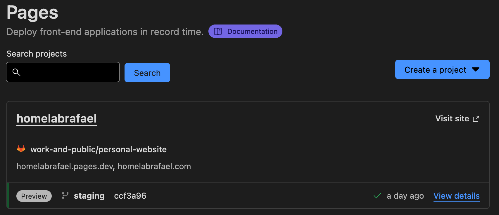
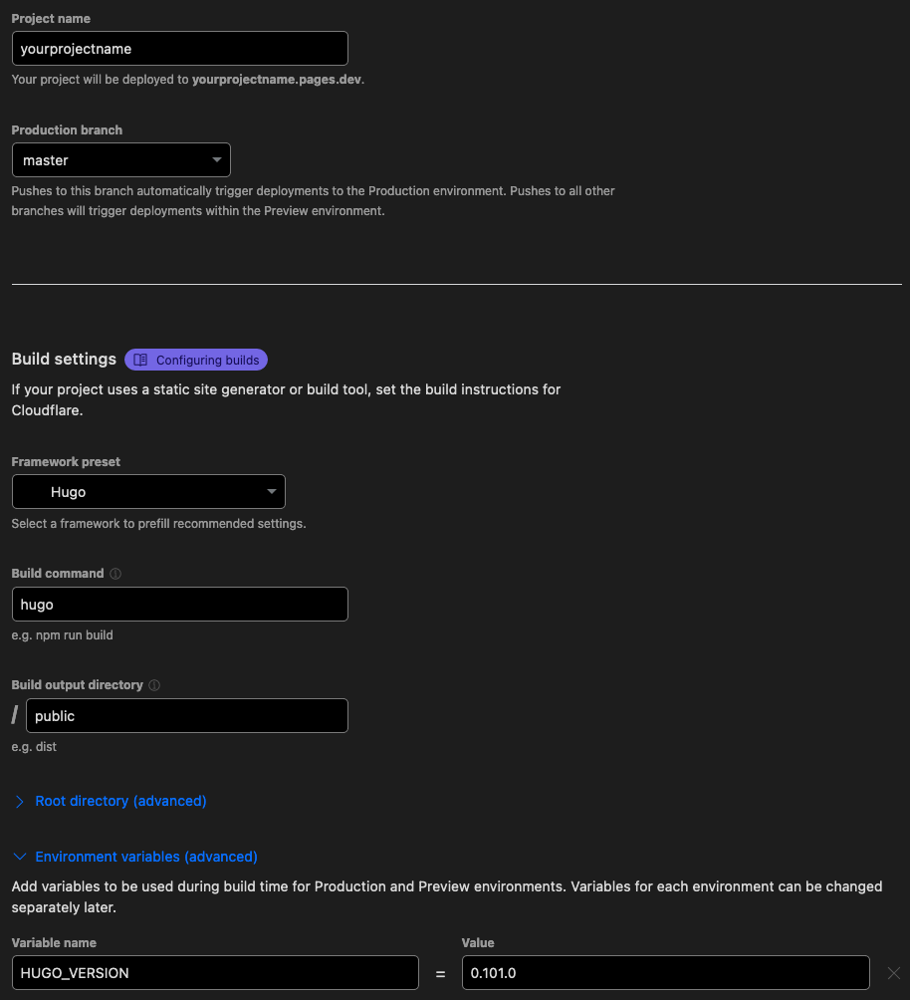
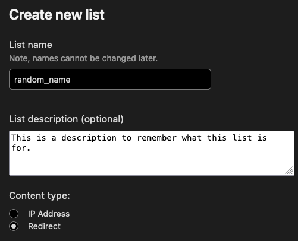

+++
title = "How to deploy a static website on Cloudflare Pages"
date = "2019-07-11"
author = "Rafael Moreira"
cover = "cloudflare.png"
images = ["posts/cloudflare-pages/cloudflare_og.png"]
tags = [ "cloudflare", "cloudflare-pages", "static website", "personal blog" ]
description = "Learn how I deployed my personal, fully static, website in Cloudflare Pages using GitLab and Hugo."
disableToc = false
+++

In this post I will showcase how I deployed this fully-static website on Cloudflare Pages using an array of FOSS technologies, available to anyone interested. The website deployed has a small footprint and is highly accelerated by Cloudflare to deliver a low latency experience to end users.

## Pre-Requisites

In this setup I have used the following tools:

- [Cloudflare](https://www.cloudflare.com/)
- [Cloudflare Pages](https://pages.cloudflare.com/)
- [Hugo](https://gohugo.io/)
- [GitLab](https://gitlab.com/)

## Get Started

First off, I generated a sample website with Hugo to get a feel for how it works and what's under the hood. I wanted something that allowed me to use Markdown as the source of my website content because I feel that for sharing my work it would be the best syntax possible and I am very comfortable with it due to my daily usage of the Markdown format for documentation and reports.

Hugo allows you to generate static content (HTML and CSS) using Go and reading your Markdown files as the input for the content of your website. This means that you can create themes that are dynamic and can render your website in any number of ways.

The command `$ hugo` generates the static content of your website into the folder `/public`, and you can see what HTML has been generated by it in these files. This will help you to debug and adjust your theme settings.

On the other hand, since these static files need to be served, the command `$ hugo server` will provide you with a development webserver, available at `localhost:1313` and will render the static files on the go, whenever changes are detected.

## Choosing a Theme

Choosing a theme was not easy, but you can go to the website provided by Hugo, [themes.gohugo.io](https://themes.gohugo.io/), and you can find a vast array of themes, as well as instructions and references to the author and the source code.

In this case, I ended up choosing the theme [Terminal, by @panr](https://github.com/panr/hugo-theme-terminal). It all came down to the fact that it is simple, minimalist and reader focused, exactly what I would like to see in other websites. This theme also does not include support for tools such as Google Analytics, but I do not feel the need for it, nor I need it since we will have analytics about our blog later on this post.

You can customize nearly anything you want in this theme, with the default configurations and the example `config.toml` and if that is not enough for you, you can customize the templates present under the directory `themes/terminal/layouts` in your project.

For example, I changed the default behavior of the footer section on the file `themes/terminal/layouts/partials/footer.html` to include my name on the copyright, to fetch the current year and to include an hyperlink for the theme I used as well as Hugo's website. These small changes will not run you any trouble and anyone can make them, even me, a person that is not affectionate to front-end development, can do. On the theme's GitHub page there are detailed instructions on how to further personalize the theme.

## Creating a Cloudflare Page

For this step, you will not need a Domain for the website, but one can be used. In this case, it is the difference between serving the website on the domain `homelabrafael.com` and `homelabrafael.pages.dev` (`pages.dev` is a Cloudflare domain for this product). In my case, i have the domain in which this site is being served, and it was not expensive on Cloudflare.

For this, you will need to go to to your Cloudflare account dashboard at [dash.cloudflare.com](https://dash.cloudflare.com/) and go to the `Pages` section on the left menu. Here, a screen like this should appear (without any projects):

You now want to click in the `Create a project` button, and it will prompt you with 3 options:

- Connect to Git
- Direct Upload
- View Wrangler CLI Guide

I chose the option `Connect to Git` since I keep my website in a GitLab repository. After this, it will prompt you to authorize the connection between Cloudflare and GitLab, but GitHub may also be used, it just comes down to your preference.

Keep in mind that you need to authorize HTTPS clone in your GitLab group settings because if you only authorize SSH clones, the _runner_ that Cloudflare launches upon each deployment will not be able to clone the repository, since it uses HTTPS.

After that, you need to select the project template, in this case Hugo, and name your project. Something I advise you is to enter the following environment variable `HUGO_VERSION` to `0.101.0` since this will ensure that the runner that builds your project will be up to date with the latest Hugo release. You may also change the root of the project inside your repository.

After this, just click `Save and Deploy` and your new fully static website will be deployed to Cloudflare's endless array of servers and available at `https://yourprojectname.pages.dev`.

Under the tab `Custom domains` on your project dashboard you can add a custom domain to your website and Cloudflare will setup the DNS records for you, and manage them when you want to delete the project as well.

There are just a few settings you may want to change on the `Settings` tab, such as:

- General:
  - Enable Access Policy to prevent anyone from accessing `yourprojectname.pages.dev` directly (I will go over how to configure redirects for this later)
  - Enable Web Analytics (very useful and very little intrusive)
- Builds & deployments
  - Configure one or more preview branches on your repository in order to have a preview website prior to merging the changes to production

These are just some tips, you may change them later to your needs and likes. Now if we go over to the `Zero Trust Dashboard` at [dash.teams.cloudflare](https://dash.teams.cloudflare.com/) we can see the previously create rule that prevents anyone from accessing `*.yourprojectname.pages.dev`. This means that nobody will be able to access your preview websites unless you allow them to. You can add custom rules for your websites here, but refer to Cloudflare's extensive documentation on the topic.

Finally, a neat trick that I can give you is to create a `Bulk Redirect`, a feature that allows you do divert traffic from your `.pages.dev` DNS record to your root domain DNS record, by simply creating a redirect list under `Manage Account` > `Configurations` > `Lists` > `Create a new list` according to this spec:

On the next step you can configure as many redirect as needed, but for this case you need to do the following:

|      **Source URL**       | **Target URL** | **Status** |
| :-----------------------: | :------------: | :--------: |
| yourprojectname.pages.dev | yourdomain.com |    301     |

After this, simply save the list, head over to the `Bulk Redirects` page on the menu on the left, click on `Create Bulk Redirects`, give your new rule a name and select the list you previously created, then click on `Save and Deploy` and it should now be working.

## Wrap-up

You should now be set-up. Each time a new commit is pushed onto the repository, Cloudflare will trigger a pipeline that will in turn deploy your changes to the website. Since this is a fully-static website, using Cloudflare will accelerate the user experience by a lot and for this purpose it should be enough.

Keep in mind that you can use functions that allow you to run Javascript on your website just like you would on a normal server, this has a free tier and can be increased by moving your account from a free tier to a pro tier, for example. I plan on implementing this further down the road with custom forms for contacts and other ends.

I use GitLab daily and one of the reasons I love it, coming from a DevOps background, is the pipelines and, in this case, Gitlab's integration is seamless so we get the following view under `CI/CD` > `Pipelines`:

At this point it should be smooth sailing for you, just write whatever's in your mind and do your own customizations, completely free (or with the small cost of a domain).
